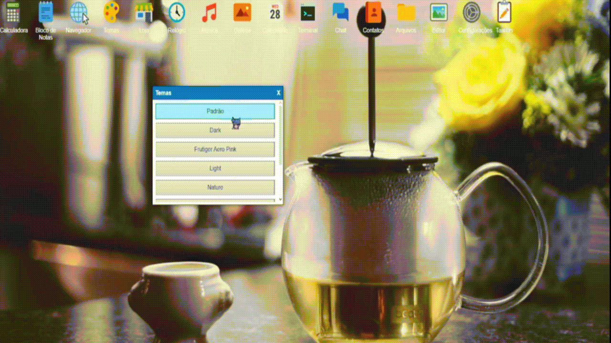

# Olá, sou Yasmin! 👩‍💻

👾 **Pronomes:** ela/dela  
💻 **Linguagens favoritas:** CSS, HTML, Ruby on Rails  
🤖 **Paixões:** Amo Machine Learning, IA generativa e exploração de Big Data  

# Acesse meu sistema operacional, baseado em web!! Tem varias coisinhas legais!!!
- ##"link para o projeto: https://github.com/YasminHtml1/meu-sistema-operacional"##
- Demonstrando a o projeto! Aqui estamos alterando o tema

e para o sistema operacional:"https://yasminhtml1.github.io/meu-sistema-operacional/"

🛠️ **Habilidades técnicas:**  
- **Front-end:** Desenvolvimento avançado em HTML, CSS, SCSS e JavaScript (ES6+), com foco em design responsivo, animações e acessibilidade.  
- **Back-end:** Experiência sólida em Ruby on Rails, PHP e Lua, com arquitetura RESTful, APIs GraphQL e autenticação JWT.  
- **Cibersegurança:**  
  - Pentest avançado (OWASP Top 10, fuzzing e exploiting de vulnerabilidades).  
  - Implementação de políticas de hardening (Linux e servidores web).  
  - Ferramentas: Metasploit, Wireshark, Burp Suite e Nmap.  
- **Outros:**  
  - Automação e scripting com Bash e Python.  
  - Programação em C para manipulação de sistemas de baixo nível.  
  - Conhecimentos em SCADA e sistemas embarcados.  

🌐 **Web Development:** Sou apaixonada por desenvolvimento web, combinando a estética do front-end com a lógica robusta do back-end para criar experiências únicas. Adoro trabalhar com frameworks modernos e padrões de design como MVC, DRY e SOLID.

🚀 **Cibersegurança avançada:** Além de criar, sou entusiasta de Ethical Hacking e defesa cibernética. Minha abordagem é sempre "Red Team meets Blue Team", buscando vulnerabilidades para torná-las oportunidades de aprendizado e melhoria.

🎨 **Curiosidades:** Sou apaixonada por criar interfaces elegantes que combinam **UI/UX** com segurança de ponta. Sempre conectada às novidades em **DevSecOps** e **Zero Trust Architecture**.

💡 **Vamos colaborar?**  
Se você é tão apaixonado por codar, aprender e hackear de forma ética quanto eu, vamos trocar ideias e criar soluções incríveis! 🖥️
