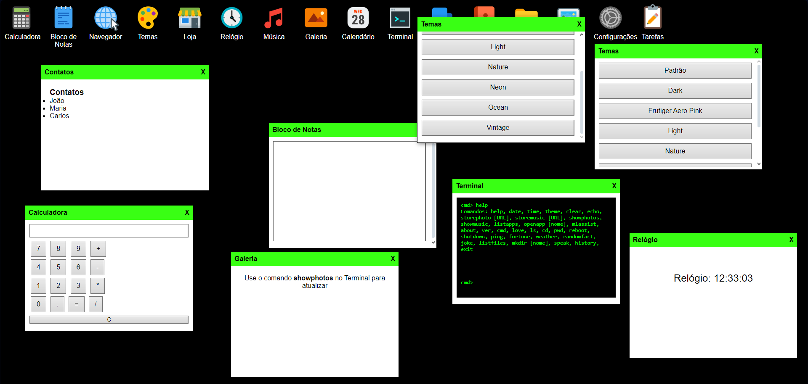
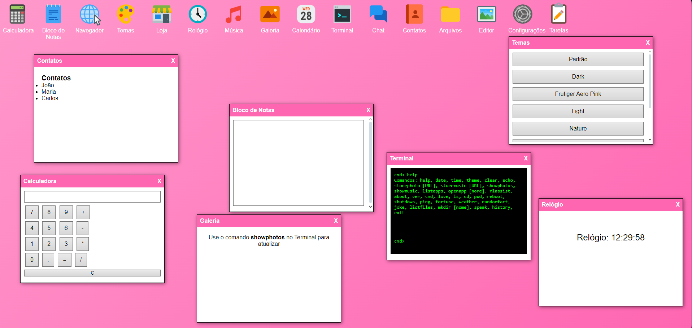

# 👋 Olá, sou Yasmin! 👩‍💻

### 🔹 **Quem sou eu?**  
🎨 Desenvolvedora full-stack apaixonada por **Machine Learning** e **Aprendizado por Reforço**.  
🔐 Entusiasta em **Cibersegurança** e **Pentest**, unindo tecnologia e defesa digital.

---

## 🚀 **Meu Sistema Operacional Web**  
### 🖥️ Explore meu projeto cheio de recursos e temas incríveis, ou veja como aprender programação em HTML/CSS!  

- **Como Aprender HTML/CSS:**
  [Clique aqui](https://yasminhtml1.github.io/Como-aprender-html-/)
  
- **Repositorio dele!:**
  [Clique aqui](https://github.com/YasminHtml1/Como-aprender-html-)

---

- **Sistema Operacional Web:**
  [Acesse aqui](https://yasminhtml1.github.io/meu-sistema-operacional/)

- **Repositório GitHub(sistema operacional):**
  [Código-Fonte](https://github.com/YasminHtml1/meu-sistema-operacional)

---

### 📌 **Demonstração do Sistema operacional simulado**
#### 🎨 **Mudança de Tema**  

#### 📂 **Abrindo aplicativos e movendo**  

#### 🟩 **Tela Inicial - Tema Hacker**  

#### 💖 **Tela Inicial - Tema Frutiger Aero Pink**  

---

## 🛠️ **Habilidades Técnicas**

**Front-end**  
- HTML, CSS, SCSS, JavaScript (ES6+)  
- UI/UX Design Responsivo e Acessibilidade  
- Animações e Interatividade Avançada  

**Back-end**  
- Ruby on Rails, PHP, Lua  
- Arquitetura RESTful e APIs GraphQL  
- Autenticação JWT e segurança de aplicações  

**Cibersegurança**  
- Pentest avançado (OWASP Top 10, Fuzzing, Exploits)  
- Hardening de servidores Linux e Web  
- Ferramentas: Metasploit, Wireshark, Burp Suite, Nmap  

**Outros conhecimentos**  
- Scripting e automação com Bash e Python  
- Desenvolvimento em C para sistemas embarcados  
- SCADA e Segurança de Infraestrutura Crítica  

---

## 🌟 **Curiosidades sobre mim**  
- Criadora de interfaces elegantes, unindo **UI/UX** e **segurança de ponta**.  
- Apaixonada por **DevSecOps** e **Zero Trust Architecture**.  
- Sempre explorando novas formas de integrar segurança e inovação tecnológica!  

---

### 🔐 ODEIO REDES >:( 🔐  
▄︻デ══━一 (Redes, PHP)  

---

## 📬 **Vamos conversar?**  
Se você ama código, inovação e desafios, me chama!  
💡 **Podemos criar algo incrível juntos!** 🚀
